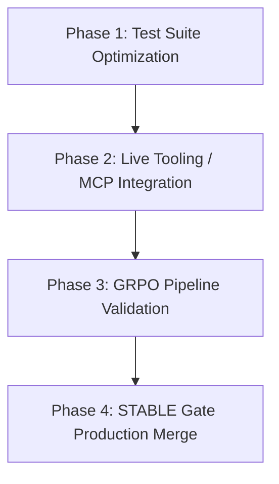

# ThinkLM Project Status & Roadmap Report

This report provides a comprehensive overview of the current developmental stage of the **ThinkLM (Self-Evolving Language Model)** project, highlights architectural bottlenecks, and outlines a structured roadmap of what to do next.

---

## 1. Executive Summary

ThinkLM is a cognitively inspired multi-agent reasoning system designed to transcend static inference by integrating dynamic language-driven planning, tool-awareness, graph-based memory, and iterative self-improvement. The system is split into two primary pipelines:
1. **Core Cognitive Engine**: Orchestrates query routing, builds execution task DAGs, runs parallel tool processes in a sandbox, and queries short/long-term memory.
2. **Training & Alignment Pipeline**: Implements Group Relative Policy Optimization (GRPO) and the STABLE Gate catastrophic forgetting check using SQuAD anchors and binary-search clipping.

---

## 2. Current Project Stage

The architecture has a complete foundation, with core code modules fully written and model-free components verified. 

### Component Maturity Analysis

| Component | Files | Primary Responsibility | Status | Maturity |
| :--- | :--- | :--- | :--- | :--- |
| **Master Agent** | [master.py](file:///C:/Users/Thinkpad/Desktop/ThinkLM/src/agents/master.py) | Gates queries into complexity tiers (Writer-Only, Executor-Inclusive, Planner-Enhanced) via semantic dense/lexical routing. Runs a 6-phase ReAct loop. | **Fully Implemented** | High (Supports dynamic thread-safe cancellations/user follow-ups) |
| **Planner Agent** | [planner.py](file:///C:/Users/Thinkpad/Desktop/ThinkLM/src/agents/planner.py) | Narrows tools using BM25 Instruction-Tool Retrieval (ITR) and builds task Directed Acyclic Graphs (DAGs). | **Fully Implemented** | High (Graph validation with NetworkX) |
| **Executor Agent** | [executor.py](file:///C:/Users/Thinkpad/Desktop/ThinkLM/src/agents/executor.py) | Executes task DAGs in topological layers in parallel using fallbacks. | **Implemented (Mocked)** | Medium (Core loops active, tool outputs are currently mocked/sandboxed) |
| **Writer Agent** | [writer.py](file:///C:/Users/Thinkpad/Desktop/ThinkLM/src/agents/writer.py) | Synthesizes response and manages citations. | **Fully Implemented** | High |
| **Cognitive Memory** | [memory.py](file:///C:/Users/Thinkpad/Desktop/ThinkLM/src/memory/memory.py) | Manages Episodic Buffer (sliding window W=10) and Semantic Graph facts retrieval via Spreading Activation. | **Fully Implemented** | High (Passes 100% of memory unit tests) |
| **Fact Consolidator** | [consolidation.py](file:///C:/Users/Thinkpad/Desktop/ThinkLM/src/memory/consolidation.py) | Extracts and resolves conflicting episodic interactions into the semantic graph. | **Fully Implemented** | High |
| **GRPO Trainer** | [grpo_trainer.py](file:///C:/Users/Thinkpad/Desktop/ThinkLM/src/training/grpo_trainer.py) | Implements relative reinforcement learning for Causal LMs. | **Fully Implemented** | Medium (Requires model pipeline optimization) |
| **STABLE Gate** | [stable_gate.py](file:///C:/Users/Thinkpad/Desktop/ThinkLM/src/training/stable_gate.py) | Evaluates exact match drop on SQuAD anchor dataset and computes safe LoRA scale clipping. | **Fully Implemented** | Medium-High (Includes binary search clipping) |
| **Runtime CLI** | [main.py](file:///C:/Users/Thinkpad/Desktop/ThinkLM/src/main.py) [dispatcher.py](file:///C:/Users/Thinkpad/Desktop/ThinkLM/src/utils/dispatcher.py) | Bootstraps the platform, processes input, supports REPL slash commands (`/mode`, `/clear`, `/undo`, `/mcp`). | **Fully Implemented** | High (Includes state snapshot undo stack) |

### Test Verification Status

A subset of the unit tests has been partitioned and verified as **100% passing** (12 out of 12 tests executed successfully in 40.41 seconds):

*   **Episodic Sliding Buffer**: Eviction validation (sliding window limit enforcement) works perfectly.
*   **Semantic Graph Facts**: Addition, lookup, weight updates, and edge attributes work correctly.
*   **Local Python Sandbox**: Subprocess execution constraints and stdout/stderr capture are functional.
*   **Token Counter**: Budget audits for prompt exposure work correctly.

---

## 3. Key Issues & Bottlenecks

While the codebase is structurally complete, three key issues hinder production deployment and local development:

> [!WARNING]
> ### 1. PyTest Suite Imports Blocked by Top-Level Model Loading
> Almost all training-related tests (e.g., [test_advantages.py](file:///C:/Users/Thinkpad/Desktop/ThinkLM/tests/test_advantages.py), [test_grpo_training.py](file:///C:/Users/Thinkpad/Desktop/ThinkLM/tests/test_grpo_training.py), [test_stable_pipeline.py](file:///C:/Users/Thinkpad/Desktop/ThinkLM/tests/test_stable_pipeline.py)) execute `load_thinklm_model()` at the **global module level**.
> When running `pytest`, it automatically imports all files in the `tests/` directory to collect tests. This triggers multiple parallel or sequential attempts to download and load a full 1.5B parameter Qwen model in bitsandbytes 4-bit precision during test collection, causing long hangs, network timeout failures, and OOM issues in CI/CD environments.

> [!IMPORTANT]
> ### 2. Local Mock Fallback Dominance in Tool Execution
> The [ExecutorAgent](file:///C:/Users/Thinkpad/Desktop/ThinkLM/src/agents/executor.py#L95-L149) currently resolves most external requests (like search queries about Dhoni/Caesar/Kohli) via a series of hardcoded `if/elif` statements checking the query text. While fine for demonstration, the agent needs to transition to a true Model Context Protocol (MCP) server integration or live APIs to perform real-world tasks.

> [!NOTE]
> ### 3. Heavy Dependency on Live Hugging Face Downloads
> The semantic complexity classifier (`SentenceTransformer("all-MiniLM-L6-v2")`) and model loaders are fetched directly from Hugging Face on demand. In local offline environments or machines with poor connections, this stalls the CLI startup process or routing during execution.

---

## 4. What to Do Next (Roadmap)

To guide future developer work, the following next steps are recommended:

### Phase 1: Test Suite Optimization & Refactoring
*   **Refactor training test files**: Move the model loading and execution blocks inside standard test functions (prefixed with `test_`) or pytest fixtures.
*   **Add Mocking**: Implement standard `unittest.mock` tests for the `GRPOTrainer` and `STABLEGate` pipelines, allowing unit test execution without loading 1.5B+ parameter models.
*   **Partition Test Execution**: Configure `pytest.ini` markers to isolate fast CPU-only unit tests (e.g., memory, sandbox, routing) from heavy GPU-based model training tests.

### Phase 2: Live Tooling & Sandbox Refinement
*   **Establish Real MCP Connections**: Implement a real Model Context Protocol (MCP) client connection in [PlannerAgent](file:///C:/Users/Thinkpad/Desktop/ThinkLM/src/agents/planner.py) and [ExecutorAgent](file:///C:/Users/Thinkpad/Desktop/ThinkLM/src/agents/executor.py) to fetch real weather, stocks, or web search queries.
*   **Enhance Docker/Process Isolation**: Refine the local Python fallback sandbox execution engine to use fully isolated runtime execution profiles rather than native subprocess.

### Phase 3: Alignment Training Execution
*   **Run a Baseline GRPO step**: Execute a controlled training run with a small batch of prompts using `src/training/train_grpo.py` on a GPU machine.
*   **Configure Reward Functions**: Implement specific reward classes (e.g., format compliance, length constraints, correctness) in `src/training/reward_model.py` to drive RL policy improvement.

### Phase 4: STABLE Gate Merge Verification
*   **Benchmark Catastrophic Forgetting**: Conduct a real LoRA evaluation run using the SQuAD anchor dataset on the base Qwen model vs. the fine-tuned candidate.
*   **Validate Binary Search Scale Clipping**: Verify that the STABLE Gate dynamically and correctly determines the safe LoRA blending factor $\alpha$ when a catastrophic forgetting metric exceeds the safety threshold.
